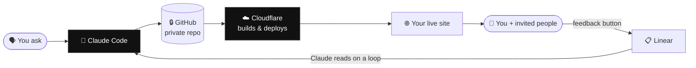
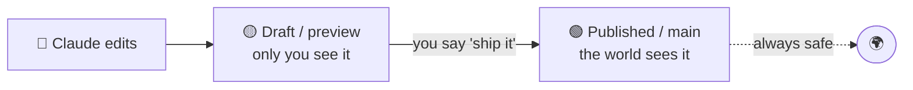
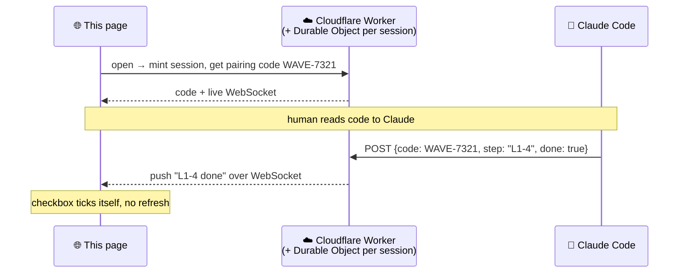

# Publish Yourself

### A page that builds you a website — while you watch.

You're not reading a manual. You're looking at a **program**.

You hand this page's address to **Claude Code**, and Claude reads the instructions on it
*out loud*, then does the work for you — one small step at a time. It stops and asks
whenever it needs a key or a decision. It tells you, in plain words, what it's about to do
and why it's safe. You watch the checkboxes below tick off as the two of you go.

The pretty story on this page is for **you**. The fenced grey blocks are the orders for
**the machine** — left in the open, on purpose, so nothing is hidden. This is an open book.

> **To begin:** open Claude Code on your computer and say:
> *"Read https://«this-page» and walk me through it, step by step."*

---

## Where you are in the journey

<!-- progress:overview -->

- [ ] **L0 — Foundations** · the right tools, your first accounts, and how keys keep you safe
- [ ] **L1 — The Pipe** · your first real website, live on the internet, in two colours (draft & published)
- [ ] **L2 — The Gate** · a lock on the door — a password, then an invite list
- [ ] **L3 — The Cards** · shareable links that look like little business cards
- [ ] **L4 — The Art** · beautiful AI images, including ones of *you*
- [ ] **L5 — The Loop** · a feedback button that quietly files bugs and gets them fixed
- [ ] **L6 — The Signature** · a version stamp and a change log, so you always know what's live
- [ ] **L7 — Deep Integrations** · real email and identity, wired in properly

Each level ends in a **checkpoint** — a moment where you both stop, confirm it works, and
take a breath before moving on. You can stop after any level and have something real.

---

## How the checkboxes know

When you opened this page it made you a private **session** and a short **pairing code** —
you'll see it near the top, something like `WAVE-7321`. Give that code to Claude. From then
on, every time Claude finishes a step it tells the page, and the box ticks itself. You never
log in; the code is the only thing the two of you share.

*(If you haven't set anything up yet, don't worry — Claude will just say "tick box 3" and the
page remembers it on your device. The live magic switches on once you've got the plumbing.)*

The technical shape of this is in the [Appendix](#appendix-how-live-progress-works) — but you
don't need it to start.

---

## The mental model (read this once, then forget it)

Six players. Learn them as **roles**, not software:

| Role | Who plays it | In one line |
|---|---|---|
| 🤖 **The Builder** | Claude Code | The hands. Reads this page, writes your site, asks before anything risky. |
| 🔒 **The Vault** | GitHub (private) | Every version of your site, kept private. Your time machine. |
| ☁️ **The Publisher & Doorman** | Cloudflare | Puts the site on the internet, *and* guards the door, *and* owns your web address. |
| 🎨 **The Art Department** | OpenAI / Google images | Makes pictures — including ones of you — and music. |
| 📋 **The Inbox** | Linear | Catches feedback and bugs, and queues them up as jobs for the Builder. |
| 🪪 **The Membership Desk** | Google / Microsoft / LinkedIn | Lets the right people in by who they already are. |

And here's the only diagram that matters — **the loop**. Everything you build just adds to this ring:

You speak. Claude writes it into the Vault. The Publisher puts it online. People see it,
and press a button when something's wrong. That lands in the Inbox. The Builder reads the
Inbox and fixes it. Round and round — and most days you only ever touch the *"You ask"* part.

---

## A word about keys (this is the part people fear, so we say it plainly)

A **key** is just a password for one robot to talk to another. You'll collect a handful of
them. Three rules, and Claude will hold you to all three:

1. **Keys never go on the website.** They live in a locked drawer (Cloudflare's secret store,
   or a hidden `.env` file that is *never* saved to GitHub). Claude will refuse to put a key
   anywhere a visitor could see it.
2. **Private means private.** Your code lives in a *private* repository. You still publish the
   *website*; the *recipe* stays locked. This is how you publish safely.
3. **You can always pull a key.** Every key can be cancelled and re-made in seconds if you ever
   feel uneasy. Nothing here is permanent.

> 🤖 **Claude, the standing rule for this whole guide:** before writing any secret, state out
> loud (a) what the key is for, (b) where you are about to store it, and (c) confirm it will
> not be committed to git. Pause for the human to say yes. After each level's checkpoint,
> remind them which keys now exist and where they live.

---
---

# L0 — Foundations
### The right tools, your first accounts, and a safe place for keys.

**What you'll have at the end:** Claude Code running with the powers it needs, a GitHub
account, a Cloudflare account, and a clear head about keys. No website yet — this is the
workshop, before the woodwork.

**Why it matters:** Two wrong turns trip everyone up. First, people try this inside *Claude
on the web*, which can't reach your computer's tools — you need **Claude Code**, the one that
lives on your machine. Second, people rush past keys and then panic. We do neither.

🖼️ *(picture: the workshop — the six players as friendly labelled tools on a bench)*

> 🤖 **Claude — runbook L0.** Go gently. This person may never have seen a terminal. Explain
> each thing in one sentence before you do it. Confirm the tool you're running in first.

<!-- progress:L0 -->

- [ ] **L0-1 · Confirm we're in the right room.** Check you are Claude **Code** (with tool
      access), not Claude on the web. If not, tell the human how to switch, and stop here.
- [ ] **L0-2 · Make a GitHub account (the Vault).** Send them to github.com to sign up, or
      confirm they already have one. Explain: this is where every version of their site lives,
      *privately*.
- [ ] **L0-3 · Connect this computer to GitHub.** Set up the login so Claude can save work to
      the Vault (GitHub CLI or an SSH key). Explain what you're doing in one line.
- [ ] **L0-4 · Make a Cloudflare account (the Publisher).** Send them to cloudflare.com to sign
      up. Explain: this is what puts the site online, guards the door, and can sell them their
      web address later. We choose it over GitHub's own publishing because it does *far* more.
- [ ] **L0-5 · Give Claude its tools.** Install the bits Claude needs to drive Cloudflare
      (the `wrangler` tool) and confirm GitHub access works.
- [ ] **L0-6 · Build the locked drawer.** Create the place keys will live. Show the human the
      hidden `.env` file and the rule that it is *never* saved to GitHub. Let them see it's real.

> ✅ **Checkpoint L0.** Say back to the human, in plain words: *"You now have two accounts — a
> Vault and a Publisher — and a locked drawer for keys. No website yet, and that's correct. We
> spent zero pounds. Shall we put something on the internet?"* Wait for a yes.

<!-- checkpoint:L0 -->

- [ ] **✅ L0 complete** — foundations laid, keys safe, ready to publish.

---

# L1 — The Pipe
### Your first website, live — and the two-colour trick that makes it safe to experiment.

**What you'll have at the end:** a real web address showing the words **"Hello, world — nice
to meet you."** And, crucially, you'll understand how to change it *without fear*, because
you'll have seen the **draft** version and the **published** version side by side.

**Why it matters:** This is the whole pipe, end to end — you speak, it appears online. Once
this works, everything else is just *making the page nicer*. The magic to internalise here is
**two colours**: there is the website the world sees (**published / main**), and a private
**draft / preview** that only you see. You experiment in the draft. When it's good, you flip
it to published. Nothing the world sees ever breaks while you tinker.

🖼️ *(diagram: two browser windows — "what the world sees" (Hello, world) and "your private
draft" (Goodbye, world) — with a switch between them)*

> 🤖 **Claude — runbook L1.** This is the emotional turning point — the moment the internet
> shows *their* words. Make it feel like a small ceremony.

<!-- progress:L1 -->

- [ ] **L1-1 · Make the Vault for this site.** Create a new **private** GitHub repository. Say
      the word *private* out loud and why.
- [ ] **L1-2 · Write "Hello, world."** Create the simplest possible page: *"Hello, world — nice
      to meet you."* Save it to the Vault.
- [ ] **L1-3 · Hand the Vault to the Publisher.** Connect Cloudflare Pages to the GitHub repo so
      that every save automatically builds and deploys. Explain: from now on, *saving = publishing*.
- [ ] **L1-4 · Watch it go live.** Open the web address together. Let them see their words on the
      real internet. (This is the ceremony — pause here.)
- [ ] **L1-5 · Show the second colour.** Make a *draft* change — *"Goodbye, world"* — on a side
      branch. Show them the **preview** address where only they can see it, while the real site
      still says Hello. Two colours, proven.
- [ ] **L1-6 · Flip the switch.** Promote the draft to published, then change it back. Let them
      feel the switch in their own hands. This removes the fear forever.

> ✅ **Checkpoint L1.** *"You have a website. The world sees one version; you can safely
> experiment on another and flip between them. From here on, you'll never break the live site
> by trying things. Want to put a lock on the door before we make it beautiful?"*

<!-- checkpoint:L1 -->

- [ ] **✅ L1 complete** — you are live on the internet, and safe to experiment.

---

# L2 — The Gate
### A lock on the door. Start with a password; add an invite list if you like.

**What you'll have at the end:** your site asks for a password (or emails a one-time code)
before anyone can see it. Optionally, a list of *exactly which people* are allowed in.

**Why it matters:** Now you can build things that aren't for the whole world — a page for a
client, your family, your team. The Publisher (Cloudflare) is genuinely excellent at this, and
the **simple version takes five minutes.** The fancier "log in with Google/Microsoft" version
is a tempting rabbit hole — we'll mark it clearly as **optional**, because it's where people
get stuck and quit. Lock first; fancy later.

🖼️ *(diagram: a door — three locks shown: a password, a one-time email code, and an invite list)*

> 🤖 **Claude — runbook L2.** Default to the simplest lock that meets their need. Do **not**
> lead them into identity-provider setup unless they ask; offer it as a clearly-labelled side
> quest at the end.

<!-- progress:L2 -->

- [ ] **L2-1 · Decide who it's for.** Ask: the whole world, a few named people, or just you?
- [ ] **L2-2 · Put a lock on (the 5-minute version).** Turn on Cloudflare Access with either a
      shared password or one-time email codes (visitor types their email, gets a code, types it
      in, they're in). No accounts to manage.
- [ ] **L2-3 · Test the lock from the outside.** Open the site in a private window together and
      watch it ask for the code. Prove the lock is real.
- [ ] **L2-4 · (Optional) The invite list.** If they have a list of email addresses, add them as
      an allow-list so only those people get in.
- [ ] **L2-5 · ✨ (Side quest — optional) The slick login.** *Only if asked:* wire up "Sign in
      with Google / Microsoft / LinkedIn" so trusted people get in with one tap. Clearly flag
      this as extra polish, not required.

> ✅ **Checkpoint L2.** *"The door is locked. Only the people you chose can get in. Want to make
> the links you share look gorgeous?"*

<!-- checkpoint:L2 -->

- [ ] **✅ L2 complete** — your site is private to exactly the people you choose.

---

# L3 — The Cards
### Links that arrive looking like little business cards.

**What you'll have at the end:** when you paste your link into iMessage, WhatsApp, LinkedIn or
a text, it doesn't show as naked blue text — it blooms into a **card**: your title, a line of
description, and a picture. A link that looks like *you*.

**Why it matters:** These shareable links are the real product for a lot of people — they're
**digital business cards**. There are two flavours, and the Publisher supports *both*, which is
one of the big reasons we chose it:

- **The classic card** (Open Graph) — what Facebook and WhatsApp read.
- **The rich card** — the fuller preview iMessage and friends show.

🖼️ *(picture: the same link shown three ways — a bare URL, a basic card, and a rich card with a
face on it)*

> 🤖 **Claude — runbook L3.** Get the preview *images* right; this is where cards usually look
> broken. Test the actual rendered card, don't assume.

<!-- progress:L3 -->

- [ ] **L3-1 · Write the card details.** Add the title, description, and preview-image tags to
      the page so sharing apps know what to show.
- [ ] **L3-2 · Add a card picture.** Use a good image (you'll make a better one of yourself in
      L4). Make sure it's the right size and shape so it isn't cropped ugly.
- [ ] **L3-3 · Test it for real.** Send the link into iMessage and WhatsApp and look at the card
      with your own eyes. Fix the spacing/crop until it's lovely.
- [ ] **L3-4 · (Optional) A card per person/page.** If different links should show different
      cards, set that up so each share is bespoke.

> ✅ **Checkpoint L3.** *"Your links now arrive as cards. Ready to make real artwork — including
> pictures of you?"*

<!-- checkpoint:L3 -->

- [ ] **✅ L3 complete** — your shared links look like business cards.

---

# L4 — The Art
### Beautiful AI images — including ones of you.

**What you'll have at the end:** the power to ask for any image and get it, plus a small set of
reference photos that let the AI make convincing pictures of *your own face* in any scene.

**Why it matters:** This is the level that makes the site feel premium. It needs one new
account with a little credit on it (this is the first level that costs a few real pounds). The
clever part is the **headshot ritual**: a short, specific photo set that teaches the AI how
your face actually moves, so the pictures of you look like you — not like a stranger.

🖼️ *(picture: the 7-shot headshot grid — straight, smiling, frowning, left, right, up, down)*

> 🤖 **Claude — runbook L4.** Image generation fails often — build in retries and show the human
> options rather than one take-it-or-leave-it result. Be patient and encouraging about the
> photos; people feel awkward taking them.

<!-- progress:L4 -->

- [ ] **L4-1 · Open an art account.** Set up image generation (OpenAI's image model, which takes
      up to ~16 reference images; and/or Google's "nano banana" / Gemini image model). Add a
      small amount of credit. Explain the cost honestly.
- [ ] **L4-2 · Store the key safely.** Put the new key in the locked drawer — never on the site.
      (Remind them of the rule.)
- [ ] **L4-3 · The headshot ritual.** Coach them through **seven** photos, same lighting:
      *looking straight, smiling, frowning, turned left, turned right, tilted up, tilted down.*
      This teaches the AI how their face deforms.
- [ ] **L4-4 · First portrait.** Generate a picture of them in a scene they choose. Offer a few
      variations. Retry until one is genuinely good.
- [ ] **L4-5 · Dress the website.** Add the best images to the site (and refresh the L3 card
      picture with a real portrait of them).

> ✅ **Checkpoint L4.** *"You can now make any image, including ones of you, and your site looks
> the part. Want it to start fixing itself when something's wrong?"*

<!-- checkpoint:L4 -->

- [ ] **✅ L4 complete** — your site has real artwork, and so do your cards.

---

# L5 — The Loop
### A feedback button that files bugs — and a Builder that quietly fixes them.

**What you'll have at the end:** a button on your site. You (or an invited person) press it,
scribble a circle around what's wrong, type a note, and it's filed. Meanwhile Claude is
watching that pile and fixing things — *without you opening Claude Code at all.*

**Why it matters:** This closes the loop from the big diagram. It turns "I don't like that bit"
into a fixed website, with almost no effort from you. The Inbox here is **Linear** — it costs a
small subscription, but it's worth it because it's *API-driven*: the website can push bugs into
it, and Claude can read them out, with nobody copy-pasting.

🖼️ *(diagram: the feedback button → screenshot + arrow → Linear ticket → Claude on a loop → fix
→ redeploy, drawn as the closing half of the main ring)*

> 🤖 **Claude — runbook L5.** The feedback widget should capture *just the current view* (a
> screenshot of what they're looking at, not the whole page), let them annotate it, and tag it
> with whoever they're logged in as. On the read side, dedupe tickets before acting.

<!-- progress:L5 -->

- [ ] **L5-1 · Open the Inbox.** Set up a Linear account and the key to talk to it. (Costs a
      small subscription — say so.)
- [ ] **L5-2 · Add the feedback button.** Put a button on the site that: takes a screenshot of
      the current view, lets them draw a circle/arrow, asks a short "what's wrong here?", and
      tags it with their logged-in identity.
- [ ] **L5-3 · Wire button → Inbox.** Make the button file a ticket into Linear automatically.
- [ ] **L5-4 · Send a test bug.** Press it yourself, file one, and watch it appear in Linear.
- [ ] **L5-5 · Set the Builder on a loop.** Configure Claude to read new tickets on a schedule,
      reproduce them, fix them, and redeploy — then mark the ticket done.
- [ ] **L5-6 · Watch a full lap.** File a real "change this" and watch it get fixed and shipped
      without you touching Claude Code.

> ✅ **Checkpoint L5.** *"Your website now repairs itself from a button. Want a version stamp and
> a change log so you always know exactly what's live?"*

<!-- checkpoint:L5 -->

- [ ] **✅ L5 complete** — feedback in one end, fixes out the other, hands-free.

---

# L6 — The Signature
### A quiet stamp in the corner: who made it, which version, and what changed.

**What you'll have at the end:** a small mark on the site showing the build number and when it
was published, plus a **change log** — a running list of what got fixed, that you can drill into.

**Why it matters:** It's the trust layer. You can always glance at the corner and know *exactly*
which version is live and when it shipped — and the change log, built from the Inbox tickets,
gives you a soft, honest record of progress. It can be public, or visible only to you.

🖼️ *(picture: a corner badge — "v128 · published 2 hours ago · ✍️ signed" — expanding into a
tidy change log)*

> 🤖 **Claude — runbook L6.** Generate the change log from completed Linear tickets, summarised
> in human language, each drilling down to its ticket.

<!-- progress:L6 -->

- [ ] **L6-1 · Stamp the corner.** Add a small badge showing the build number and publish time,
      and a "signed by" mark.
- [ ] **L6-2 · Build the change log.** Turn completed tickets into a readable list of what
      changed, newest first.
- [ ] **L6-3 · Decide who sees it.** Choose: change log public, or behind the L2 lock for your
      eyes only.
- [ ] **L6-4 · Make it drill down.** Let each change-log line open the ticket behind it.

> ✅ **Checkpoint L6.** *"You can now always see what's live and what changed. Want to wire in
> real email and identity — the proper, powerful versions?"*

<!-- checkpoint:L6 -->

- [ ] **✅ L6 complete** — every version is stamped and accounted for.

---

# L7 — Deep Integrations
### Real email and identity — wired in properly, not the toy way.

**What you'll have at the end:** genuine, deep access to email and identity through Google and
Microsoft — far more capable than the easy "connect" buttons, which are deliberately limited.

**Why it matters:** The convenient integrations run through a narrow door and quickly hit their
limits. The powerful way is to set up a small **application** of your own — on Google
(`script.google.com`) or Microsoft (`entra.microsoft.com`) — with its own key and scripts. It's
more fiddly, but it gives you real reach. This is advanced, and clearly optional.

🖼️ *(diagram: the "easy button" (small pipe) vs. "your own application + shared key" (wide pipe)
into Google and Microsoft)*

> 🤖 **Claude — runbook L7.** This is the most key-heavy level. Slow down, narrate every secret,
> and store everything in the locked drawer. Confirm at each step.

<!-- progress:L7 -->

- [ ] **L7-1 · Pick the platform.** Google, Microsoft, or both.
- [ ] **L7-2 · Stand up your own application.** Create the app (Google Apps Script / Microsoft
      Entra), generate its key, install the scripts that grant the wider access.
- [ ] **L7-3 · Lock the keys away.** Store every credential in the locked drawer; confirm none
      touch GitHub.
- [ ] **L7-4 · Prove it works.** Do one real action (send/read an email, check an identity) to
      confirm the deep pipe is live.

> ✅ **Checkpoint L7.** *"You're fully wired. From here you can ask for almost anything — 'publish
> me a password-protected site for my company that does financial projections' — and the whole
> machine just does it."*

<!-- checkpoint:L7 -->

- [ ] **✅ L7 complete** — the full machine is yours.

---
---

## What it costs (told straight)

No surprises. Rough monthly shape:

| Thing | Cost | When it starts |
|---|---|---|
| Claude Code | your existing subscription | L0 |
| GitHub | free (private repos included) | L0 |
| Cloudflare | free to start; small fees for extras | L1 |
| A web address (domain) | a few pounds/year | optional, around L1–L3 |
| AI images | a few pounds of credit, pay as you go | L4 |
| Linear (the Inbox) | small monthly subscription | L5 |

You can stop after **L1** and pay essentially nothing. The serious costs only arrive when you
ask for serious things.

---

## Appendix — how live progress works

*(For the curious, and for whoever hosts this guide. Skip it; it changes nothing about running
the program.)*

The page and your local Claude need to agree on "which boxes are ticked" without you logging in.
We borrow the **device-pairing** pattern (like signing a TV into a streaming app):

- **Durable Objects** give you exactly one tiny live coordinator per visitor — the right tool
  for per-session real-time state.
- The **pairing code** is the only shared secret. No accounts, no login.
- **Bootstrap paradox:** this backend runs on Cloudflare — the very thing the guide sets up. So
  **the author hosts one progress Worker**, and every reader borrows it to track their own
  journey until they've built their own infrastructure.
- **Graceful fallback:** before a reader has *any* infrastructure, there's no Worker to call —
  Claude simply says "tick box 3" and the page stores progress in `localStorage`. The live sync
  lights up later, for free.

---

*This page is self-hosted by the exact pipeline it teaches. It built itself.*
